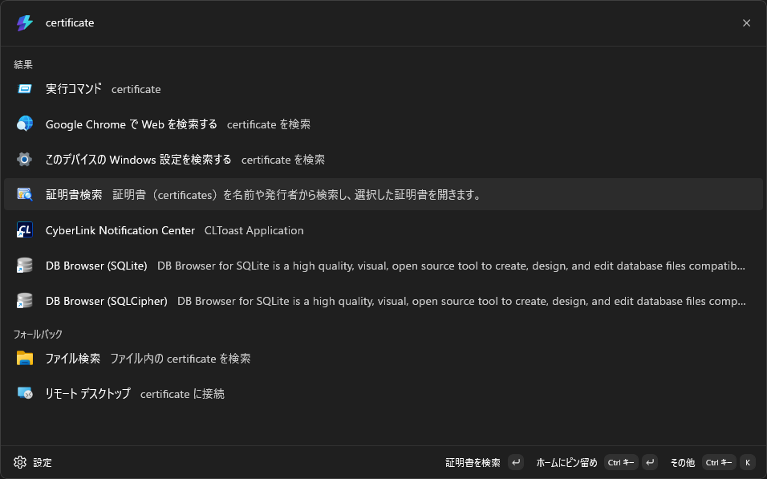
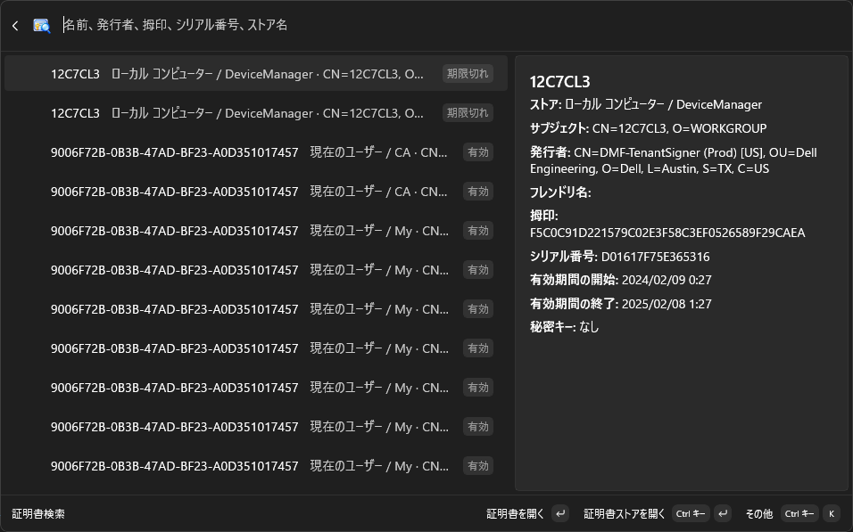
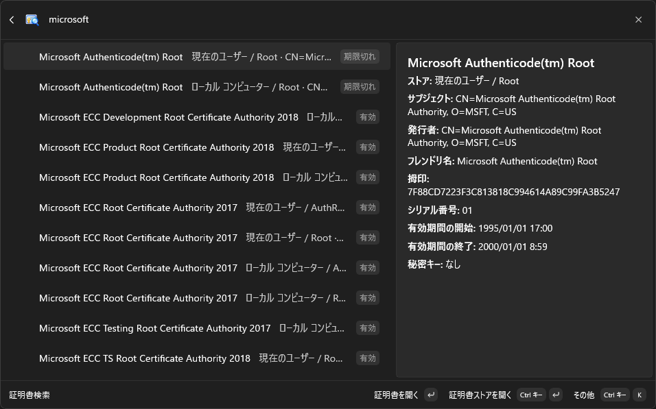

# PowerToys Command Palette 用証明書検索

[English](README.md)

Windows の現在のユーザーとローカル コンピューターの証明書ストアを [Microsoft PowerToys の Command Palette](https://learn.microsoft.com/ja-jp/windows/powertoys/command-palette/overview) から検索し、選択した証明書を Windows の証明書マネージャーで開く拡張機能です。

Command Palette は Microsoft PowerToys に含まれる、キーボード中心のランチャーです。アプリ、コマンド、ファイル、拡張機能が提供するツールを1か所から探せます。既定では <kbd>Win</kbd>+<kbd>Alt</kbd>+<kbd>Space</kbd> で開きます。

## インストール

開発用には、Visual Studio で `CertificateSearch.slnx` を開き、**CertificateSearch (Package)** プロファイルで配置します。Windows デバイスに合わせて x64 または ARM64 を選んでください。コマンドラインでの確認方法は[ビルドとテスト](#ビルドとテスト)を参照してください。

## 主な機能

- 現在のユーザーとローカル コンピューターの証明書を検索できます。デバイス上で見つかった独自のストアも対象です。
- サブジェクト、フレンドリ名、発行者、拇印、シリアル番号、ストア名、場所で検索できます。拇印は空白の有無にかかわらず一致します。
- 検索結果と詳細欄で、ストア、有効期間、発行者、日付、秘密キーの有無を確認できます。
- MMC のツリーを手動でたどらず、該当ストアと証明書を証明書マネージャーで開けます。
- コンテキスト メニューからストアだけを開いたり、拇印、サブジェクト、発行者をコピーしたりできます。
- 拡張機能の外で証明書が変更された場合は、一覧を再読み込みできます。
- Windows の表示言語に応じて、拡張機能の画面を英語または日本語で表示します。
- Windows 10 version 2004（ビルド 19041）以降の x64 / ARM64 に対応しています。

## 使い方

1. <kbd>Win</kbd>+<kbd>Alt</kbd>+<kbd>Space</kbd> で PowerToys Command Palette を開きます（ショートカットは PowerToys の設定で変更できます）。
2. **証明書検索**を選択します。
3. 証明書名、発行者、拇印、シリアル番号、ストア名の一部を入力します。たとえば `DigiCert` や `Root` で検索できます。
4. 検索結果を選びます。ローカル コンピューターの証明書では、Windows の UAC 確認を承認します。
5. 証明書マネージャーで選択された証明書を確認します。ストアだけを開く場合や項目をコピーする場合は、コンテキスト メニューを使います。

拡張機能は証明書、信頼設定、秘密キーを変更せず、ストアを読み取り専用で扱います。Windows の UI Automation で対象行を一意に特定できない場合は、証明書を選択せずに該当ストアを開きます。

## 画面イメージ

| 拡張機能を検索 | 証明書の一覧を表示 |
| :---: | :---: |
| [](docs/images/ja-JP/01-find-extension.png) | [](docs/images/ja-JP/02-certificate-list.png) |
| **証明書を絞り込み** | **選択した証明書を開く** |
| [](docs/images/ja-JP/03-filter-certificates.png) | [](docs/images/ja-JP/04-open-certificate.png) |

画像4枚は後で追加する予定です。

## 動作要件

- Windows 10 version 2004（ビルド 19041）以降
- Command Palette を有効にした [Microsoft PowerToys](https://learn.microsoft.com/ja-jp/windows/powertoys/install)
- Windows の証明書マネージャー（`certmgr.msc` と `certlm.msc`）

個々のストアへのアクセスは Windows の権限によって異なります。ローカル コンピューターの証明書を開く場合は UAC の承認が必要ですが、検索と一覧表示には不要です。

## 仕組み

拡張機能は Windows の証明書 API で利用可能なストアを読み取り、ページを開いたときに検索用の一覧を作ります。**証明書を再読み込み**を選ぶと一覧を読み込み直します。ストアは読み取り専用で開き、1つのストアを読めなくてもほかのストアの読み込みは続けます。

ローカル コンピューターの結果では、短時間だけ動作する管理者権限のヘルパーが証明書を再確認してから `certlm.msc` を開きます。現在のユーザーの結果では `certmgr.msc` を開きます。Windows の UI Automation でストア内の一覧を探し、一致する証明書が一意に特定できたときだけ行を選択します。マウス座標や画像認識は使いません。

## 開発

### 必要な環境

- Windows 10 version 2004 以降
- [.NET 10 SDK](https://dotnet.microsoft.com/download/dotnet/10.0)
- 拡張機能を配置する場合は、Windows アプリケーション開発と MSIX ツールを含む Visual Studio

### ビルドとテスト

リポジトリのルートで実行します。

```powershell
dotnet restore
dotnet build CertificateSearch.slnx -p:Platform=x64
dotnet run --project tests/CertificateSearch.Tests/CertificateSearch.Tests.csproj
```

現在の Windows にある証明書ストアを読み取り専用で追加確認する場合は、次を実行します。

```powershell
dotnet run --project tests/CertificateSearch.Tests/CertificateSearch.Tests.csproj -- --smoke
```

テストは証明書ストアを変更しません。実際の画面操作を確認するには、拡張機能を配置し、対象ストア内の既知の証明書を使ってください。

### 診断ログ

Debug と Release のどちらも、操作の進行状況だけを `%LOCALAPPDATA%\CertificateSearch\navigation-YYYY-MM-DD.log` に記録します。直近7日分を保持し、古いファイルは次の書き込み時に削除します。容量の上限はなく、証明書のサブジェクトや拇印は記録しません。

### Microsoft Store 提出用パッケージ

パッケージのバージョンは `Directory.Build.props` で管理します。`./scripts/Build-StoreUpload.ps1` を実行すると、マニフェストのバージョンを同期し、Partner Center に提出する x64/ARM64 の未署名 `.msixupload` を生成できます。詳しくは [Store リリース手順](docs/StoreRelease.md)を参照してください。

## コントリビューション

Issue と Pull Request を歓迎します。証明書検索や MMC への移動を変更した場合はテストを実行し、可能であれば現在のユーザーとローカル コンピューターの両方の証明書で確認してください。

## ライセンス

新規作成したソース ファイルには MIT License の表記があります。Command Palette のテンプレート由来のファイルには、元のライセンス表記を残しています。
