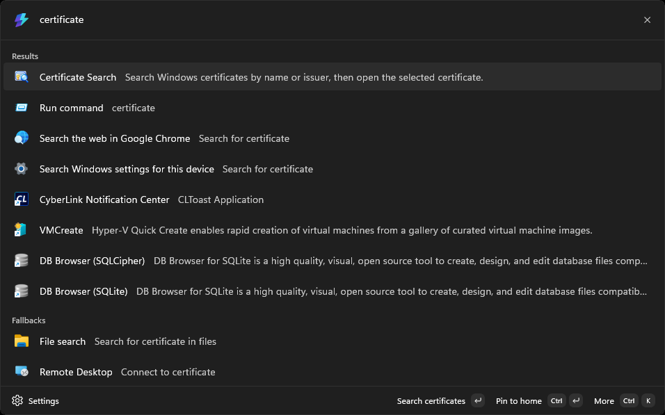
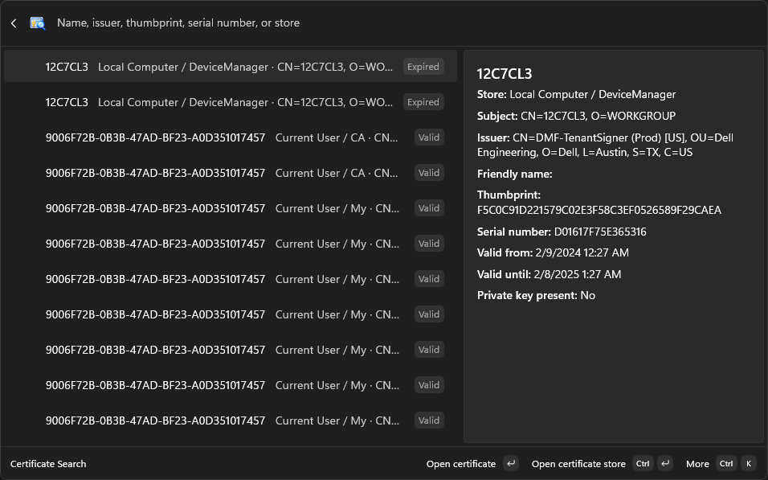
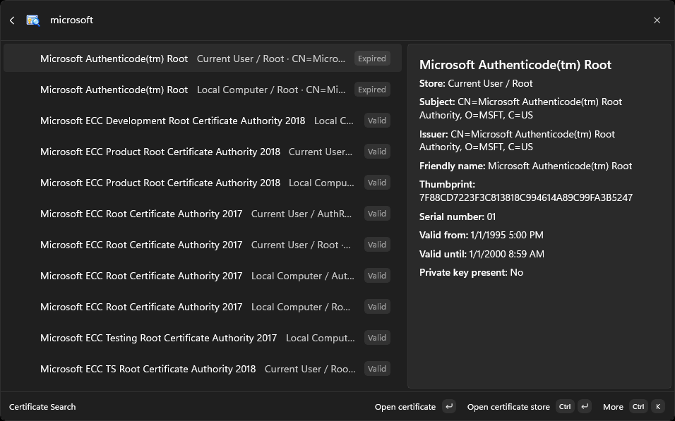
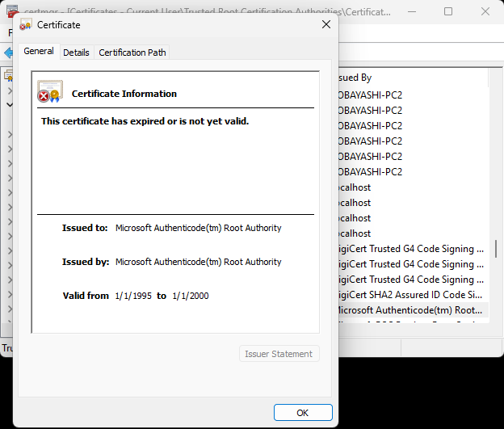

# Certificate Search for PowerToys Command Palette

[日本語](README.ja.md)

Search certificates in the Windows Current User and Local Computer stores from [Microsoft PowerToys Command Palette](https://learn.microsoft.com/windows/powertoys/command-palette/overview), then open the selected certificate in Windows Certificate Manager.

Command Palette is a keyboard-first launcher included with Microsoft PowerToys. It brings apps, commands, files, and extension-provided tools together in one place. By default, press <kbd>Win</kbd>+<kbd>Alt</kbd>+<kbd>Space</kbd> to open it.

## Installation

For development, open `CertificateSearch.slnx` in Visual Studio and deploy the **CertificateSearch (Package)** profile. Select x64 or ARM64 to match your Windows device. See [Build and test](#build-and-test) for command-line verification.

## Features

- Search certificates in the Current User and Local Computer stores, including custom stores discovered on the device.
- Find certificates by subject, friendly name, issuer, thumbprint, serial number, store name, or location. Thumbprints match with or without spaces.
- See the store, validity, issuer, dates, and private-key presence in the result and details pane.
- Open the matching store and certificate in Windows Certificate Manager without navigating its tree manually.
- Open a store separately, or copy a certificate's thumbprint, subject, or issuer from the context menu.
- Refresh the list after certificates change outside the extension.
- Show the extension interface in English or Japanese according to the Windows UI language.
- Support x64 and ARM64 on Windows 10 version 2004 (build 19041) or later.

## Usage

1. Open PowerToys Command Palette with <kbd>Win</kbd>+<kbd>Alt</kbd>+<kbd>Space</kbd> (the shortcut can be changed in PowerToys settings).
2. Select **Certificate Search**.
3. Enter part of a certificate name, issuer, thumbprint, serial number, or store name—for example, `DigiCert` or `Root`.
4. Select a result. If Windows requests UAC approval to open Certificate Manager, approve the prompt.
5. Review the selected certificate in Windows Certificate Manager. Use the context menu if you only want to open its store or copy a field.

The extension reads certificate stores without changing certificates, trust settings, or private keys. If Windows does not expose a unique matching row to UI Automation, Certificate Manager opens at the store without selecting a certificate.

## Screenshots

| Find the extension | Browse certificates |
| :---: | :---: |
| [](docs/images/en-US/01-find-extension.png) | [](docs/images/en-US/02-certificate-list.png) |
| **Filter certificates** | **Open the selected certificate** |
| [](docs/images/en-US/03-filter-certificates.png) | [](docs/images/en-US/04-open-certificate-properties.png) |


## Requirements

- Windows 10 version 2004 (build 19041) or later
- [Microsoft PowerToys](https://learn.microsoft.com/windows/powertoys/install) with Command Palette enabled
- Windows Certificate Manager (`certmgr.msc` and `certlm.msc`)

Access to individual stores can depend on Windows permissions. Opening a Local Computer certificate requires UAC approval. Some Windows configurations also require approval when opening a Current User certificate; searching and listing certificates do not.

## How it works

The extension reads available stores with the Windows certificate APIs and builds a search index when its page opens. **Refresh certificates** reloads that index. Store reads are read-only, and a failure in one store does not stop the others from loading.

For a Local Computer result, a short-lived elevated helper verifies the selected certificate again before opening `certlm.msc`. Current User results open in `certmgr.msc`; if Windows requires elevation to start MMC, the helper verifies the certificate under the same user account first. Windows UI Automation finds the store's certificate list and selects a row only when it can identify one matching certificate. The extension does not use mouse coordinates or image recognition.

## Documentation

- [Localization](docs/Localization.md)
- [Microsoft Store release process](docs/StoreRelease.md)
- [Privacy policy](docs/PrivacyPolicy.md)

## Development

### Prerequisites

- Windows 10 version 2004 or later
- [.NET 10 SDK](https://dotnet.microsoft.com/download/dotnet/10.0)
- Visual Studio with Windows application and MSIX tooling when deploying the extension

### Build and test

From the repository root:

```powershell
dotnet restore
dotnet build CertificateSearch.slnx -p:Platform=x64
dotnet run --project tests/CertificateSearch.Tests/CertificateSearch.Tests.csproj
```

To additionally enumerate the current machine's certificate stores in read-only mode:

```powershell
dotnet run --project tests/CertificateSearch.Tests/CertificateSearch.Tests.csproj -- --smoke
```

The tests do not modify certificate stores. Interactive verification requires a deployed extension and a known certificate in the relevant store.

### Diagnostics

Debug and Release builds write stage-only navigation logs to `%LOCALAPPDATA%\CertificateSearch\navigation-YYYY-MM-DD.log`. The latest seven calendar days are retained; older logs are removed on the next write. Logs have no size limit and do not contain certificate subjects or thumbprints.

### Microsoft Store package

The package version is managed in `Directory.Build.props`. Run `./scripts/Build-StoreUpload.ps1` to synchronize the manifest and create the unsigned x64/ARM64 `.msixupload` for Partner Center. See the [Store release instructions](docs/StoreRelease.md).

## Contributing

Issues and pull requests are welcome. Please verify changes to certificate search and MMC navigation with the tests and, when possible, with certificates in both Current User and Local Computer stores.

## License

New source files carry the MIT License notice. Files from the Command Palette template retain their existing license notices.
